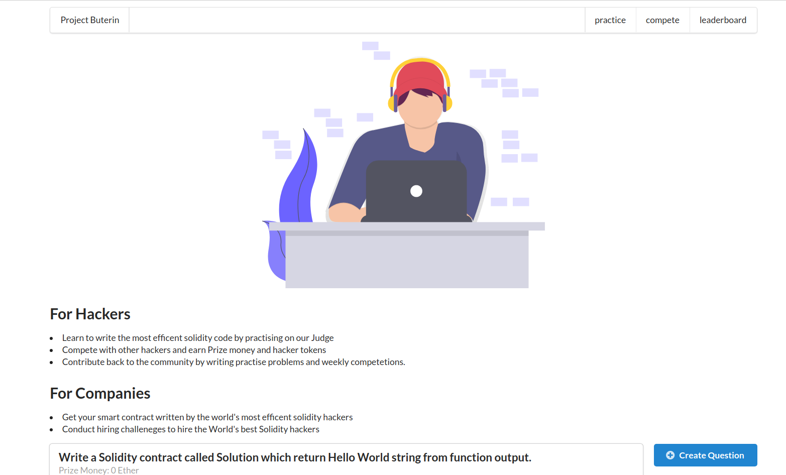
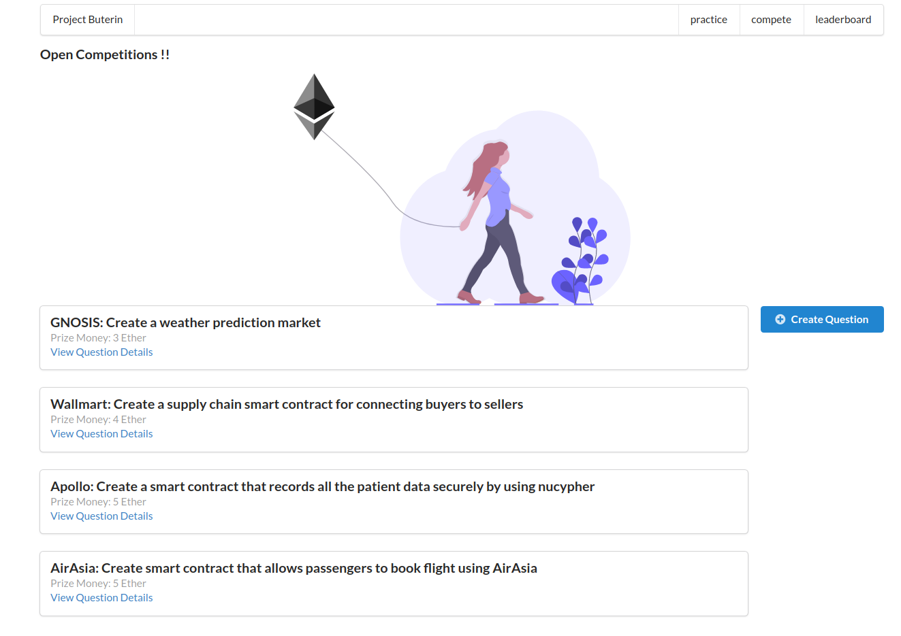

# Project Buterin

Project Buterin is a community of solidity hackers who are interested in writing the most efficent solidty code as possible. Project Buterin consists of a practise platform and competetion platform where hackers can submit solutions for problems listed in platforms. The submissions would be rated on the gas used.

## For Hackers
* Learn to write the most efficent solidity code by practising on our Judge
* Compete with other hackers and earn Prize money and hacker tokens
* Contribute back to the community by writing practise problems and weekly competetions.

## For Companies
* Get your smart contract written by the world's most efficent solidity hackers
* Conduct hiring challeneges to hire the World's best Solidity hackers

# Tech Stack
* web3
* django
* nodejs
* ganache
* React
* Next.js
* Solidity

# Project URL
* Frontend - https://github.com/sameer2800/project-butarin-new/tree/building-blockchain
* Backend - https://github.com/hackerkid/project-buterin-backend

# Team members
* [Raj Killamsetty](https://github.com/sameer2800)
* [Vishnu Ks](https://github.com/hackerkid)
